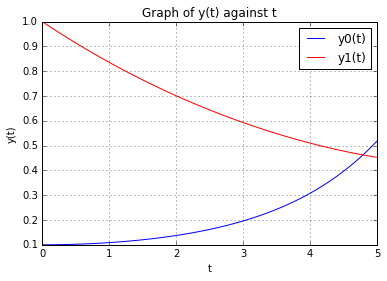

UECM3033 Assignment #3 Report
========================================================

- Prepared by: Khoo Jia Ming
- Tutorial Group: T3

--------------------------------------------------------

## Task 1 --  Gauss-Legendre formula

The reports, codes and supporting documents are to be uploaded to Github at: 

[https://github.com/JiaMing1993/UECM3033_assign3](https://github.com/JiaMing1993/UECM3033_assign3)

First, get the weights and nodes by using numpy.polynomial.legendre.leggauss(n). As there’s two cases could be happened which is case 1, a = -1 ; b=1, and case 2 , a not equal to -1 ; b not equal to 1, therefore if else loop is used. When it is case 1, just use the formula of G(f) = w1*f(x1) + w2*f(x2) + … + wN*f(xN). If it is case 2, use (a+b)/2)+(((b-a)/2) to be the transformation to transform a and b to -1 and 1. Since the transformation are used, the function will have a d/dt, thus, use (b-a)/2.

I get the weights and nodes by using numpy.polynomial.legendre.leggauss(n). The code is to compute the sample points and weight for Gauss-Legendre quadrature. These sample points and weights will correctly integrate polynomials of degree 2*(n-1) or less over the interval [-1,1] with the weight function f(x) = 1.

---------------------------------------------------------

## Task 2 -- Predator-prey model

Where a and b are positive constants, and a prime (‘) denotes a derivative. To solve this equation with odeint, we first convert it to a system of first order equations. Let y be the vector [y0,y1]. We implement the system in spyder by making a function called pend(). I set the constant as a = 1.0 and b = 0.2. for initial conditions, y0 = 0.1, y1 = 1.0 . I generate a solution 101 evenly spaced samples in the interval between 0 to 5. Call odeint to generate the solution. To pass the parameters a and c to pend, I give them to odeint using args argument. Lastly plot the graph.

The blue line indicates as a prey while the red line indicates as a predator. The graph shown above just for 5 years long. From the graph, I can see that, initially, the prey are very less (blue line on bottom), while the predator are very much (red line on top). So when the number of predator are huge, while number of prey are less, the predator hard to get the prey as their food, thus, the number of predator drops in in the next year. As the predator drop, the prey starts to increase. This natural phenomenon continues until t=4.7. At t=4.7, the number of predator are same with number of prey. After that, the number of predators are still falling and the number of prey are still increasing.

The system of ODE not so sensitive to initial condition. The changes in the graph are not very obvious. When I use y0(0) as 0.1, the equivalent point( the intersect point of y0(t) and y1(t)) is about 4.8, while  I use y0(0) as 0.1, the equivalent point is about 4.7. If we set the time(t) to be longer to 40 years, we can see that the maximum point of y0(t) also slightly changed only. When I use y0(0) as 0.1, the maximum point of y0(t) is about 3.7, while  I use y0(0) as 0.1, the maximum point of y0(t) is about 3.6. From changing the value in spyder, we can know that, the system of ODE is not such sensitive.

-----------------------------------

last modified: 17 APRIL 2016
